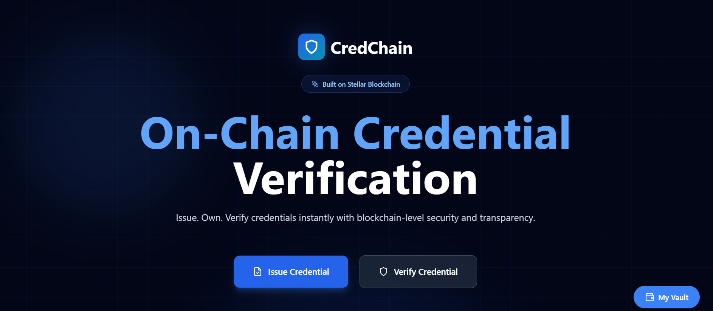
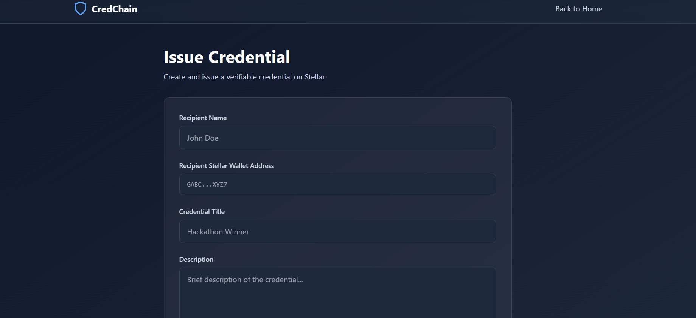

# 🚀 CredChain – On-Chain Credential Verification on Stellar

CredChain is a **decentralized credential issuance and verification platform** built on the **Stellar Testnet**.
It allows issuers to create **verifiable on-chain credentials** and enables anyone to **instantly verify credentials using a Stellar wallet address**.

---

## 🌟 Features

* 🔐 **On-chain credential issuance** using Stellar custom assets
* 📦 **Metadata stored on IPFS** (proof & description)
* 🧾 **Instant credential verification** via Stellar Horizon
* ⚡ **Fast & low-cost** transactions on Stellar Testnet
* 🎨 **Modern UI** built with React + Tailwind CSS
* 🧩 **Clean backend API** using FastAPI

---

## 🏗️ Architecture Overview

```
Frontend (React + Vite)
        |
        |  HTTP (REST API)
        v
Backend (FastAPI)
        |
        |  Stellar SDK
        v
Stellar Testnet (Assets = Credentials)
        |
        |  IPFS
        v
Credential Metadata
```

---

## 📸 Screenshots






---

## 🧑‍💻 Tech Stack

### Frontend

* React 18
* Vite
* Tailwind CSS
* Lucide Icons

### Backend

* FastAPI
* Stellar Python SDK
* IPFS (via HTTP API)
* Uvicorn

### Blockchain

* Stellar Testnet
* Horizon API

---

## 📁 Project Structure

```
credchain-stellar/
│
├── backend/
│   ├── main.py              # FastAPI entry point
│   ├── stellar_utils.py     # Stellar asset logic
│   ├── ipfs_utils.py        # IPFS upload helper
│   ├── .env                 # Secrets (ignored)
│
├── src/
│   ├── components/          # UI components
│   ├── api.js               # Frontend → Backend API calls
│   ├── App.jsx              # Main React app
│   ├── main.jsx
│
├── index.html
├── package.json
├── tailwind.config.js
├── postcss.config.js
└── README.md
```

---

## ⚙️ Setup Instructions

### 1️⃣ Clone Repository

```bash
git clone https://github.com/<your-username>/credchain-stellar.git
cd credchain-stellar
```

---

### 2️⃣ Frontend Setup

```bash
npm install
npm run dev
```

Frontend runs at:

```
http://localhost:5173
```

---

### 3️⃣ Backend Setup

```bash
cd backend
python -m venv venv
venv\Scripts\activate   # Windows
pip install -r requirements.txt
```

Create `.env` file:

```
STELLAR_ISSUER_SECRET=YOUR_TESTNET_SECRET_KEY
```

Run backend:

```bash
uvicorn main:app --reload
```

Backend runs at:

```
http://127.0.0.1:8000
```

---

## 🔗 API Endpoints

### Issue Credential

```
POST /issue-credential
```

**Body**

```json
{
  "recipient_name": "John Doe",
  "recipient_wallet": "GXXXX...",
  "credential_title": "Hackathon Winner",
  "description": "Awarded for winning",
  "proof_url": "https://ipfs.io/ipfs/..."
}
```

---

### Verify Credentials

```
GET /verify/{wallet_address}
```

Returns all on-chain credentials held by that wallet.

---

## 🧪 Testnet Notes

* Uses **Stellar Testnet**
* Credentials are represented as **custom assets**
* Wallet must:

  * Exist on testnet
  * Have trustline to issuer asset

---

## 🔐 Security

* `.env` is excluded from Git
* Private keys never exposed to frontend
* Backend signs Stellar transactions securely

---

## 🎯 Use Cases

* 🎓 Academic certificates
* 🏆 Hackathon awards
* 🧑‍💼 Skill verification
* 📜 Professional credentials

---

## 🚧 Future Improvements

* Wallet connect (Freighter)
* NFT-based credentials
* Revocation support
* Mainnet deployment
* Better IPFS pinning

---

## 👨‍💻 Author

**Sutanu Pal**
Built with ❤️ using Stellar

---

## ⭐ Support

If you like this project:

* ⭐ Star the repo
* 🍴 Fork it
* 🧠 Contribute ideas

---

